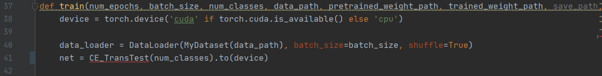
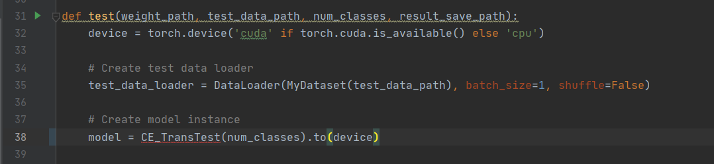

# CE-TransUnet

This Repository is Code for 'CE-TransUnet: A Convolutional Enhanced Model for Pulmonary Alveolus Pathology Image Segmentation' on ICIC.

You could follow the instruction below to reproduce our project:

## Dataset Configuration
Under the `data` folder, the directory format is as follows:
- The `JPEGImages` folder stores original images.
- The `mask_input` folder stores mask images.
Original and mask images share the same filenames.

## Preprocessing
Run `mask_input_trans.py` to convert pixel value 255 in mask images to 1.

## Configuration Adjustment
Open `utils.py` and modify the input image size, preferably in multiples of 224x224.

Open `ce_net.py` and adjust the following values if needed:

Some reference values:

- `embed_dim=96` corresponds to `num_heads(3, 6, 12, 24)`.
- `embed_dim=128` corresponds to `num_heads(4, 8, 16, 32)`.
`depths` refers to the number of CE_Transformer_Blocks.

## Training
Open `train.py` and modify the following values:

   
`CE_TransUnet` and `CE_TransTest` are optional.

Simply run `train.py` to initiate training.

## Testing
Open `test.py` and make necessary modifications.

Import the weight files into the `params` folder.

Run `test.py` to execute testing.

## Post-training Transformation
Run `res_trans.py`.
